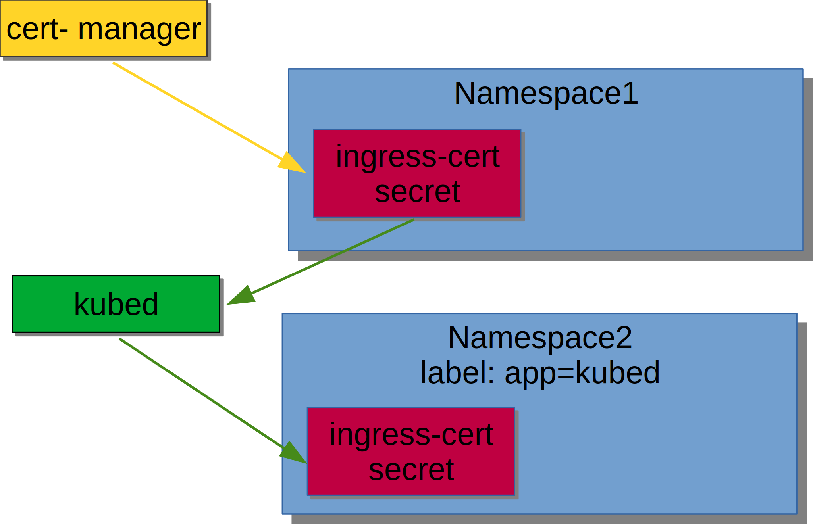

# Nginx + cert-manager + kubed installation

Before we move on with other tasks it is necessary to install Nginx Ingress.
It's also handy to install cert-manager for managing SSL certificates.


## Install cert-manager

cert-manager architecture:


Install the CRDs resources separately:

```bash
kubectl apply -f https://raw.githubusercontent.com/jetstack/cert-manager/release-0.10/deploy/manifests/00-crds.yaml
```

Output:

```text
customresourcedefinition.apiextensions.k8s.io/certificates.certmanager.k8s.io created
customresourcedefinition.apiextensions.k8s.io/challenges.certmanager.k8s.io created
customresourcedefinition.apiextensions.k8s.io/clusterissuers.certmanager.k8s.io created
customresourcedefinition.apiextensions.k8s.io/issuers.certmanager.k8s.io created
customresourcedefinition.apiextensions.k8s.io/orders.certmanager.k8s.io created
```

Create the namespace for cert-manager and label it to disable resource
validation:

```bash
kubectl create namespace cert-manager
kubectl label namespace cert-manager certmanager.k8s.io/disable-validation=true
```

Output:

```text
namespace/cert-manager created
namespace/cert-manager labeled
```

Install the cert-manager Helm chart:

```bash
helm repo add jetstack https://charts.jetstack.io
helm install --name cert-manager --namespace cert-manager --wait jetstack/cert-manager --version v0.10.0
```

Output:

```text
"jetstack" has been added to your repositories
NAME:   cert-manager
LAST DEPLOYED: Fri Jul 19 11:47:58 2019
NAMESPACE: cert-manager
STATUS: DEPLOYED

RESOURCES:
==> v1/ClusterRole
NAME               AGE
cert-manager-edit  10s
cert-manager-view  10s

==> v1/Pod(related)
NAME                                      READY  STATUS   RESTARTS  AGE
cert-manager-578fc6ff6-qjvrr              1/1    Running  0         10s
cert-manager-cainjector-5975fd64c5-82c8x  1/1    Running  0         10s

==> v1/ServiceAccount
NAME                     SECRETS  AGE
cert-manager             1        10s
cert-manager-cainjector  1        10s

==> v1beta1/ClusterRole
NAME                     AGE
cert-manager             10s
cert-manager-cainjector  10s

==> v1beta1/ClusterRoleBinding
NAME                     AGE
cert-manager             10s
cert-manager-cainjector  10s

==> v1beta1/Deployment
NAME                     READY  UP-TO-DATE  AVAILABLE  AGE
cert-manager             1/1    1           1          10s
cert-manager-cainjector  1/1    1           1          10s


NOTES:
cert-manager has been deployed successfully!

In order to begin issuing certificates, you will need to set up a ClusterIssuer
or Issuer resource (for example, by creating a 'letsencrypt-staging' issuer).

More information on the different types of issuers and how to configure them
can be found in our documentation:

https://docs.cert-manager.io/en/latest/reference/issuers.html

For information on how to configure cert-manager to automatically provision
Certificates for Ingress resources, take a look at the `ingress-shim`
documentation:

https://docs.cert-manager.io/en/latest/reference/ingress-shim.html
```

### Create ClusterIssuer for Let's Encrypt

Create `ClusterIssuer` for Route53 used by cert-manager. It will allow Let's
Encrypt to generate certificate. Route53 (DNS) method of requesting certificate
from Let's Encrypt must be used to create wildcard certificate `*.mylabs.dev`
(details [here](https://community.letsencrypt.org/t/wildcard-certificates-via-http-01/51223)).


([https://b3n.org/intranet-ssl-certificates-using-lets-encrypt-dns-01/](https://b3n.org/intranet-ssl-certificates-using-lets-encrypt-dns-01/))

```bash
export EKS_CERT_MANAGER_ROUTE53_AWS_SECRET_ACCESS_KEY_BASE64=$(echo -n "$EKS_CERT_MANAGER_ROUTE53_AWS_SECRET_ACCESS_KEY" | base64)
envsubst < files/cert-manager-letsencrypt-aws-route53-clusterissuer.yaml | kubectl apply -f -
cat files/cert-manager-letsencrypt-aws-route53-clusterissuer.yaml
```

Output:

```text{16,23,48}
secret/aws-route53-secret-access-key-secret created
clusterissuer.certmanager.k8s.io/selfsigning-issuer created
clusterissuer.certmanager.k8s.io/letsencrypt-staging-dns created
clusterissuer.certmanager.k8s.io/letsencrypt-production-dns created
apiVersion: v1
kind: Secret
metadata:
  name: aws-route53-secret-access-key-secret
  namespace: cert-manager
data:
  secret-access-key: $EKS_CERT_MANAGER_ROUTE53_AWS_SECRET_ACCESS_KEY_BASE64
---
apiVersion: certmanager.k8s.io/v1alpha1
kind: ClusterIssuer
metadata:
  name: selfsigning-issuer
spec:
  selfSigned: {}
---
apiVersion: certmanager.k8s.io/v1alpha1
kind: ClusterIssuer
metadata:
  name: letsencrypt-staging-dns
  namespace: cert-manager
spec:
  acme:
    # The ACME server URL
    server: https://acme-staging-v02.api.letsencrypt.org/directory
    # Email address used for ACME registration
    email: petr.ruzicka@gmail.com
    # Name of a secret used to store the ACME account private key
    privateKeySecretRef:
      name: letsencrypt-staging-dns
    dns01:
      # Here we define a list of DNS-01 providers that can solve DNS challenges
      providers:
      - name: aws-route53
        route53:
          accessKeyID: ${EKS_CERT_MANAGER_ROUTE53_AWS_ACCESS_KEY_ID}
          region: eu-central-1
          secretAccessKeySecretRef:
            name: aws-route53-secret-access-key-secret
            key: secret-access-key
---
apiVersion: certmanager.k8s.io/v1alpha1
kind: ClusterIssuer
metadata:
  name: letsencrypt-production-dns
  namespace: cert-manager
spec:
  acme:
    # The ACME server URL
    server: https://acme-v02.api.letsencrypt.org/directory
    # Email address used for ACME registration
    email: petr.ruzicka@gmail.com
    # Name of a secret used to store the ACME account private key
    privateKeySecretRef:
      name: letsencrypt-production-dns
    dns01:
      # Here we define a list of DNS-01 providers that can solve DNS challenges
      # https://docs.cert-manager.io/en/latest/tasks/acme/configuring-dns01/index.html
      providers:
      - name: aws-route53
        route53:
          accessKeyID: ${EKS_CERT_MANAGER_ROUTE53_AWS_ACCESS_KEY_ID}
          region: eu-central-1
          secretAccessKeySecretRef:
            name: aws-route53-secret-access-key-secret
            key: secret-access-key
```

## Generate TLS certificate

Create certificate using cert-manager:

```bash
envsubst < files/cert-manager-letsencrypt-aws-route53-certificate.yaml | kubectl apply -f -
envsubst < files/cert-manager-letsencrypt-aws-route53-certificate.yaml
```

Output:

```text{5}
certificate.certmanager.k8s.io/ingress-cert-production created
apiVersion: certmanager.k8s.io/v1alpha1
kind: Certificate
metadata:
  name: ingress-cert-production
  namespace: cert-manager
spec:
  secretName: ingress-cert-production
  issuerRef:
    kind: ClusterIssuer
    name: letsencrypt-production-dns
  commonName: "*.mylabs.dev"
  dnsNames:
  - "*.mylabs.dev"
  acme:
    config:
    - dns01:
        provider: aws-route53
      domains:
      - "*.mylabs.dev"
```


([https://blog.openshift.com/self-serviced-end-to-end-encryption-approaches-for-applications-deployed-in-openshift/](https://blog.openshift.com/self-serviced-end-to-end-encryption-approaches-for-applications-deployed-in-openshift/))

## Install kubed

It's necessary to copy the wildcard certificate across all "future" namespaces
and that's the reason why [kubed](https://github.com/appscode/kubed) needs to be
installed (for now).
[kubed](https://github.com/appscode/kubed) can [synchronize ConfigMaps/Secrets](https://appscode.com/products/kubed/0.11.0/guides/config-syncer/)
across Kubernetes namespaces/clusters.

Kubed - synchronize secret diagram:



Add kubed helm repository:

```bash
helm repo add appscode https://charts.appscode.com/stable/
```

Output:

```text
"appscode" has been added to your repositories
```

Install kubed:

```bash
helm install appscode/kubed --name kubed --version 0.11.0 --namespace kube-system --wait \
  --set config.clusterName=my_k8s_cluster \
  --set apiserver.enabled=false
```

Output:

```text
NAME:   kubed
LAST DEPLOYED: Fri Jul 19 11:48:10 2019
NAMESPACE: kube-system
STATUS: DEPLOYED

RESOURCES:
==> v1/ClusterRole
NAME         AGE
kubed-kubed  4s

==> v1/ClusterRoleBinding
NAME                                  AGE
kubed-kubed                           4s
kubed-kubed-apiserver-auth-delegator  4s

==> v1/Pod(related)
NAME                          READY  STATUS             RESTARTS  AGE
kubed-kubed-75789b6cc6-6zrst  0/1    ContainerCreating  0         4s

==> v1/RoleBinding
NAME                                                          AGE
kubed-kubed-apiserver-extension-server-authentication-reader  4s

==> v1/Secret
NAME                        TYPE    DATA  AGE
kubed-kubed                 Opaque  1     4s
kubed-kubed-apiserver-cert  Opaque  2     4s

==> v1/Service
NAME         TYPE       CLUSTER-IP      EXTERNAL-IP  PORT(S)  AGE
kubed-kubed  ClusterIP  10.100.193.123  <none>       443/TCP  4s

==> v1/ServiceAccount
NAME         SECRETS  AGE
kubed-kubed  1        4s

==> v1beta1/Deployment
NAME         READY  UP-TO-DATE  AVAILABLE  AGE
kubed-kubed  0/1    1           0          4s


NOTES:
To verify that Kubed has started, run:

  kubectl --namespace=kube-system get deployments -l "release=kubed, app=kubed"
```

Annotate (mark) the cert-manager secret to be copied to other namespaces
if necessary:

```bash
kubectl annotate secret ingress-cert-${LETSENCRYPT_ENVIRONMENT} -n cert-manager kubed.appscode.com/sync="app=kubed"
```

Output:

```text
secret/ingress-cert-production annotated
```

## Install nginx-ingress


([https://www.nginx.com/blog/](https://www.nginx.com/blog/))

Install nginx-ingress which will also create a new loadbalancer:

```bash
helm install stable/nginx-ingress --wait --name nginx-ingress --namespace nginx-ingress-system --version 1.24.3 \
  --set rbac.create=true \
  --set controller.extraArgs.default-ssl-certificate=cert-manager/ingress-cert-${LETSENCRYPT_ENVIRONMENT}
```

Output:

```text
NAME:   nginx-ingress
LAST DEPLOYED: Fri Jul 19 11:48:17 2019
NAMESPACE: nginx-ingress-system
STATUS: DEPLOYED

RESOURCES:
==> v1/ConfigMap
NAME                      DATA  AGE
nginx-ingress-controller  1     8s

==> v1/Pod(related)
NAME                                            READY  STATUS             RESTARTS  AGE
nginx-ingress-controller-7b59c7c7bc-nhmq8       0/1    ContainerCreating  0         8s
nginx-ingress-default-backend-6d489448cb-d9brb  1/1    Running            0         8s

==> v1/Service
NAME                           TYPE          CLUSTER-IP     EXTERNAL-IP       PORT(S)                     AGE
nginx-ingress-controller       LoadBalancer  10.100.37.102  a55fd2fadaa0a...  80:30958/TCP,443:31932/TCP  8s
nginx-ingress-default-backend  ClusterIP     10.100.15.87   <none>            80/TCP                      8s

==> v1/ServiceAccount
NAME           SECRETS  AGE
nginx-ingress  1        8s

==> v1beta1/ClusterRole
NAME           AGE
nginx-ingress  8s

==> v1beta1/ClusterRoleBinding
NAME           AGE
nginx-ingress  8s

==> v1beta1/Deployment
NAME                           READY  UP-TO-DATE  AVAILABLE  AGE
nginx-ingress-controller       0/1    1           0          8s
nginx-ingress-default-backend  1/1    1           1          8s

==> v1beta1/Role
NAME           AGE
nginx-ingress  8s

==> v1beta1/RoleBinding
NAME           AGE
nginx-ingress  8s


NOTES:
The nginx-ingress controller has been installed.
It may take a few minutes for the LoadBalancer IP to be available.
You can watch the status by running 'kubectl --namespace nginx-ingress-system get services -o wide -w nginx-ingress-controller'

An example Ingress that makes use of the controller:

  apiVersion: extensions/v1beta1
  kind: Ingress
  metadata:
    annotations:
      kubernetes.io/ingress.class: nginx
    name: example
    namespace: foo
  spec:
    rules:
      - host: www.example.com
        http:
          paths:
            - backend:
                serviceName: exampleService
                servicePort: 80
              path: /
    # This section is only required if TLS is to be enabled for the Ingress
    tls:
        - hosts:
            - www.example.com
          secretName: example-tls

If TLS is enabled for the Ingress, a Secret containing the certificate and key must also be provided:

  apiVersion: v1
  kind: Secret
  metadata:
    name: example-tls
    namespace: foo
  data:
    tls.crt: <base64 encoded cert>
    tls.key: <base64 encoded key>
  type: kubernetes.io/tls
```

## Create DNS records

nginx-ingress created the loadbalancer service. In case of AWS it is
Classic Elastic Loadbalancer:

```bash
kubectl get service -n nginx-ingress-system
```

Output:

```text{2}
NAME                            TYPE           CLUSTER-IP      EXTERNAL-IP                                                                  PORT(S)                      AGE
nginx-ingress-controller        LoadBalancer   10.100.37.102   a55fd2fadaa0a11e9bcf2026dca96845-1478956562.eu-central-1.elb.amazonaws.com   80:30958/TCP,443:31932/TCP   8s
nginx-ingress-default-backend   ClusterIP      10.100.15.87    <none>                                                                       80/TCP                       8s
```

Create DNS record `mylabs.dev` for the loadbalancer created by nginx-ingress:

```bash
export LOADBALANCER_HOSTNAME=$(kubectl get svc nginx-ingress-controller -n nginx-ingress-system -o jsonpath="{.status.loadBalancer.ingress[0].hostname}")
export CANONICAL_HOSTED_ZONE_NAME_ID=$(aws elb describe-load-balancers --query "LoadBalancerDescriptions[?DNSName==\`$LOADBALANCER_HOSTNAME\`].CanonicalHostedZoneNameID" --output text)
export HOSTED_ZONE_ID=$(aws route53 list-hosted-zones --query "HostedZones[?Name==\`${MY_DOMAIN}.\`].Id" --output text)

envsubst < files/aws_route53-dns_change.json | aws route53 change-resource-record-sets --hosted-zone-id ${HOSTED_ZONE_ID} --change-batch=file:///dev/stdin | jq
```

Output:

```json
{
  "ChangeInfo": {
    "Id": "/change/C2YV79SSX0CS95",
    "Status": "PENDING",
    "SubmittedAt": "2019-07-19T09:48:29.092Z",
    "Comment": "A new record set for the zone."
  }
}
```

Wait for completion of certificate create process:

```bash
COUNT=0; OUTPUT=""; while [ "${OUTPUT}" != "True" ] && [ "${COUNT}" -lt 100 ]; do COUNT=$((COUNT+1)); OUTPUT=$(kubectl get certificate ingress-cert-${LETSENCRYPT_ENVIRONMENT} -n cert-manager -o jsonpath="{.status.conditions[0].status}"); sleep 1; echo -n "${COUNT} "; done
```


You should see the following output form cert-manager when looking at
certificates:

```bash
kubectl describe certificates -n cert-manager ingress-cert-${LETSENCRYPT_ENVIRONMENT}
```

Output

```text{26}
Name:         ingress-cert-production
Namespace:    cert-manager
Labels:       <none>
Annotations:  kubectl.kubernetes.io/last-applied-configuration:
                {"apiVersion":"certmanager.k8s.io/v1alpha1","kind":"Certificate","metadata":{"annotations":{},"name":"ingress-cert-production","namespace"...
API Version:  certmanager.k8s.io/v1alpha1
Kind:         Certificate
Metadata:
  Creation Timestamp:  2019-07-19T09:48:10Z
  Generation:          4
  Resource Version:    2919
  Self Link:           /apis/certmanager.k8s.io/v1alpha1/namespaces/cert-manager/certificates/ingress-cert-production
  UID:                 5131721b-aa0a-11e9-bcf2-026dca968456
Spec:
  Acme:
    Config:
      Dns 01:
        Provider:  aws-route53
      Domains:
        *.mylabs.dev
  Common Name:  *.mylabs.dev
  Dns Names:
    *.mylabs.dev
  Issuer Ref:
    Kind:       ClusterIssuer
    Name:       letsencrypt-production-dns
  Secret Name:  ingress-cert-production
Status:
  Conditions:
    Last Transition Time:  2019-07-19T09:49:54Z
    Message:               Certificate is up to date and has not expired
    Reason:                Ready
    Status:                True
    Type:                  Ready
  Not After:               2019-10-17T08:49:53Z
Events:
  Type     Reason              Age                  From          Message
  ----     ------              ----                 ----          -------
  Warning  IssuerNotReady      105s (x2 over 105s)  cert-manager  Issuer letsencrypt-production-dns not ready
  Normal   Generated           105s                 cert-manager  Generated new private key
  Normal   GenerateSelfSigned  105s                 cert-manager  Generated temporary self signed certificate
  Normal   OrderCreated        105s                 cert-manager  Created Order resource "ingress-cert-production-20059064"
  Normal   OrderComplete       1s                   cert-manager  Order "ingress-cert-production-20059064" completed successfully
  Normal   CertIssued          1s                   cert-manager  Certificate issued successfully
```

The Kubernetes "secret" in `cert-manager` namespace should contain the
certificates:

```bash
kubectl describe secret -n cert-manager ingress-cert-${LETSENCRYPT_ENVIRONMENT}
```

Output:

```text
Name:         ingress-cert-production
Namespace:    cert-manager
Labels:       certmanager.k8s.io/certificate-name=ingress-cert-production
Annotations:  certmanager.k8s.io/alt-names: *.mylabs.dev
              certmanager.k8s.io/common-name: *.mylabs.dev
              certmanager.k8s.io/ip-sans:
              certmanager.k8s.io/issuer-kind: ClusterIssuer
              certmanager.k8s.io/issuer-name: letsencrypt-production-dns
              kubed.appscode.com/sync: app=kubed

Type:  kubernetes.io/tls

Data
====
ca.crt:   0 bytes
tls.crt:  3550 bytes
tls.key:  1675 bytes
```

Check the SSL certificate:

```bash
while ! echo | openssl s_client -showcerts -connect ${MY_DOMAIN}:443 &> /dev/null; do sleep 1; echo -n ". "; done
echo | openssl s_client -showcerts -connect ${MY_DOMAIN}:443 | openssl x509 -inform pem -noout -text
```

Output:

```text{14}
depth=2 O = Digital Signature Trust Co., CN = DST Root CA X3
verify return:1
depth=1 C = US, O = Let's Encrypt, CN = Let's Encrypt Authority X3
verify return:1
depth=0 CN = *.mylabs.dev
verify return:1
DONE
Certificate:
    Data:
        Version: 3 (0x2)
        Serial Number:
            03:cf:14:18:90:0e:c8:7f:c2:39:eb:e5:dc:42:d7:c6:7a:a6
        Signature Algorithm: sha256WithRSAEncryption
        Issuer: C = US, O = Let's Encrypt, CN = Let's Encrypt Authority X3
        Validity
            Not Before: Jul 19 08:49:53 2019 GMT
            Not After : Oct 17 08:49:53 2019 GMT
        Subject: CN = *.mylabs.dev
        Subject Public Key Info:
            Public Key Algorithm: rsaEncryption
                RSA Public-Key: (2048 bit)
                Modulus:
...
                Exponent: 65537 (0x10001)
        X509v3 extensions:
            X509v3 Key Usage: critical
                Digital Signature, Key Encipherment
            X509v3 Extended Key Usage:
                TLS Web Server Authentication, TLS Web Client Authentication
            X509v3 Basic Constraints: critical
                CA:FALSE
            X509v3 Subject Key Identifier:
                44:C9:D2:B1:71:D6:94:92:67:DB:8C:C9:7E:0C:68:10:C3:10:41:D9
            X509v3 Authority Key Identifier:
                keyid:A8:4A:6A:63:04:7D:DD:BA:E6:D1:39:B7:A6:45:65:EF:F3:A8:EC:A1

            Authority Information Access:
                OCSP - URI:http://ocsp.int-x3.letsencrypt.org
                CA Issuers - URI:http://cert.int-x3.letsencrypt.org/

            X509v3 Subject Alternative Name:
                DNS:*.mylabs.dev
            X509v3 Certificate Policies:
                Policy: 2.23.140.1.2.1
                Policy: 1.3.6.1.4.1.44947.1.1.1
                  CPS: http://cps.letsencrypt.org
...
```
