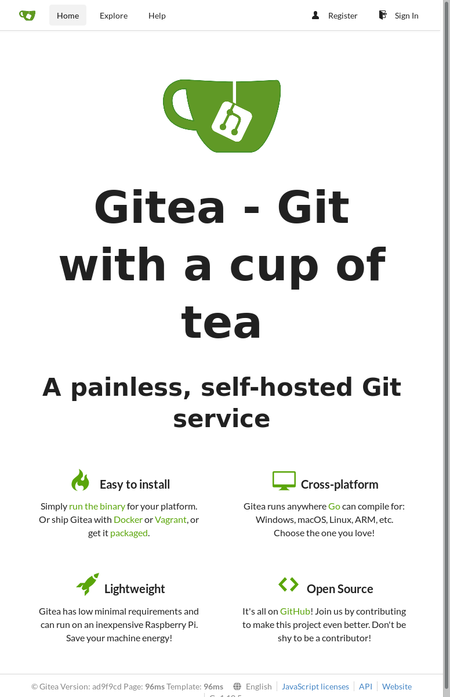

# Harbor and Helm charts

YouTube video: [https://youtu.be/XSszSd-TTCQ](https://youtu.be/XSszSd-TTCQ)

[](http://www.youtube.com/watch?v=XSszSd-TTCQ
"Manage your charts with Harbor")

## Upload Helm Chart using Web GUI

Download the compressed Helm Chart of Rook:

```bash
wget --quiet https://charts.rook.io/release/rook-ceph-v1.0.0.tgz -O rook-ceph-v1.0.0.tgz
```

Upload manually the `rook-ceph-v1.0.0.tgz` to Harbor by clicking on

Projects -> library -> Helm Chart -> UPLOAD -> `rook-ceph-v1.0.0.tgz`

Here is the API call

```bash
curl -s -X POST -u "admin:admin" "https://core.${MY_DOMAIN}/api/chartrepo/library/charts" \
  -H "Content-Type: multipart/form-data" \
  -F "chart=@rook-ceph-v1.0.0.tgz;type=application/x-yaml" \
| jq
```

Output:

```json
{
  "saved": true
}
```

## Upload Helm Chart using CLI

Add helm repository as unprivileged user:

```bash
helm repo add --username aduser05 --password admin my_project_helm_repo https://core.mylabs.dev/chartrepo/my_project
```

Output:

```text
"my_project_helm_repo" has been added to your repositories
```

Check the list of Helm repositories:

```bash
helm repo list
```

Output:

```text
NAME                    URL
stable                  https://kubernetes-charts.storage.googleapis.com
local                   http://127.0.0.1:8879/charts
jetstack                https://charts.jetstack.io
my_project_helm_repo    https://core.mylabs.dev/chartrepo/my_project
```

Push the `harbor-helm` to the `my_project_helm_repo` project in Harbor":

```bash
ls -l ./harbor-helm/
helm push --username aduser05 --password admin ./harbor-helm/ my_project_helm_repo
```

Output:

```text
total 52
-rw-r--r--  1 root root   577 May  9 17:24 CONTRIBUTING.md
-rw-r--r--  1 root root   502 May  9 17:24 Chart.yaml
-rw-r--r--  1 root root 11357 May  9 17:24 LICENSE
-rw-r--r--  1 root root 20336 May  9 17:24 README.md
drwxr-xr-x  3 root root    63 May  9 17:24 docs
drwxr-xr-x 14 root root   225 May  9 17:24 templates
-rw-r--r--  1 root root 11711 May  9 17:24 values.yaml
Pushing harbor-1.0.1.tgz to my_project_helm_repo...
Done.
```

## Upload signed Helm Chart using CLI

Create GPG key in `.gnupg/` directory:

```bash
export GNUPGHOME=$PWD/.gnupg
mkdir ${GNUPGHOME} && chmod 0700 $PWD/.gnupg

cat > ${GNUPGHOME}/my_gpg_key << EOF
%echo Generating a basic OpenPGP key
Key-Type: RSA
Key-Length: 2048
Subkey-Type: RSA
Subkey-Length: 2048
Name-Real: Helm User
Name-Comment: User
Name-Email: my_helm_user@${MY_DOMAIN}
Expire-Date: 0
%no-protection
%commit
EOF

gpg2 --verbose --batch --gen-key ${GNUPGHOME}/my_gpg_key
```

Output:

```text
gpg: keybox '/mnt/tmp/.gnupg/pubring.kbx' created
gpg: Generating a basic OpenPGP key
gpg: no running gpg-agent - starting '/usr/bin/gpg-agent'
gpg: waiting for the agent to come up ... (5s)
gpg: waiting for the agent to come up ... (4s)
gpg: connection to agent established
gpg: writing self signature
gpg: RSA/SHA512 signature from: "E1C63C9058D3358B [?]"
gpg: writing key binding signature
gpg: RSA/SHA512 signature from: "E1C63C9058D3358B [?]"
gpg: RSA/SHA512 signature from: "E1A3F789D3E4D72D [?]"
gpg: writing public key to '/mnt/tmp/.gnupg/pubring.kbx'
gpg: /mnt/tmp/.gnupg/trustdb.gpg: trustdb created
gpg: using pgp trust model
gpg: key E1C63C9058D3358B marked as ultimately trusted
gpg: directory '/mnt/tmp/.gnupg/openpgp-revocs.d' created
gpg: writing to '/mnt/tmp/.gnupg/openpgp-revocs.d/A0FC0E2B687DDA829E980C6DE1C63C9058D3358B.rev'
gpg: RSA/SHA512 signature from: "E1C63C9058D3358B Helm User (User) <my_helm_user@mylabs.dev>"
gpg: revocation certificate stored as '/mnt/tmp/.gnupg/openpgp-revocs.d/A0FC0E2B687DDA829E980C6DE1C63C9058D3358B.rev'
```

List the GPG secret key:

```bash
gpg2 --list-secret-keys
```

Output:

```text
gpg: checking the trustdb
gpg: marginals needed: 3  completes needed: 1  trust model: pgp
gpg: depth: 0  valid:   1  signed:   0  trust: 0-, 0q, 0n, 0m, 0f, 1u
/mnt/tmp/.gnupg/pubring.kbx
---------------------------
sec   rsa2048 2019-05-09 [SCEA]
      A0FC0E2B687DDA829E980C6DE1C63C9058D3358B
uid           [ultimate] Helm User (User) <my_helm_user@mylabs.dev>
ssb   rsa2048 2019-05-09 [SEA]
```

Export private GPG key into `.gnupg/secring.gpg`, because Helm doesn't
support GnuPG 2.1:

```bash
gpg2 --export-secret-keys > ${GNUPGHOME}/secring.gpg
```

Output:

```text
gpg: starting migration from earlier GnuPG versions
gpg: porting secret keys from '/mnt/tmp/.gnupg/secring.gpg' to gpg-agent
gpg: migration succeeded
```

Download and unpack Gitea Helm chart:

```bash
git clone --quiet https://github.com/jfelten/gitea-helm-chart gitea
git -C ./gitea/ checkout --quiet 8c9adad
```

Create signed Helm package:

```bash
helm package --sign --key "my_helm_user@${MY_DOMAIN}" --keyring ${GNUPGHOME}/secring.gpg --destination . ./gitea/
```

Output:

```text
Successfully packaged chart and saved it to: /mnt/tmp/gitea-1.6.1.tgz
```

There should be 2 files in current directory - the archive with the Helm Chart
and **provenance** file:

```bash
ls -la gitea*tgz*
```

Output:

```text
-rw-r--r-- 1 root root 20390 May  9 17:31 gitea-1.6.1.tgz
-rwxr-xr-x 1 root root   966 May  9 17:31 gitea-1.6.1.tgz.prov
```

See the provenance file:

```bash
cat gitea-1.6.1.tgz.prov
```

Output:

```text
----BEGIN PGP SIGNED MESSAGE-----
Hash: SHA512

appVersion: 1.6.1
description: Git with a cup of tea
icon: https://docs.gitea.io/images/gitea.png
keywords:
- - git
- - issue tracker
- - code review
- - wiki
- - gitea
- - gogs
maintainers:
- - email: john.felten@gmail.com
  name: John Felten
name: gitea
sources:
- - https://github.com/go-gitea/gitea
- - https://hub.docker.com/r/gitea/gitea/
version: 1.6.1

...
files:
  gitea-1.6.1.tgz: sha256:c7761dd2e0fca52072a6eae404bf38eba03d30269fe05b5520a3a42079f003d9
-----BEGIN PGP SIGNATURE-----

wsBcBAEBCgAQBQJc1GP6CRDhxjyQWNM1iwAAoaAIAHrwjfb5t+2giTZh/1p7F5+Q
p/l6btL1BEGiCXRXsXb8kKE2lmYqT1NV5NVolwGRjqidiMqpREXm8QVGZFBAeodZ
oJi/2Dke6jrWfw1uT9gNDQayAXqksx/zD0SmkbY9lJhClEAZIjjKcG38rmKJF91v
cFfyUxy/bC3pdbGyQcCSM5hOAOyVG7IXfPq2iu53RiF2RbFsX8OsCa5KmjuTLHtE
CXh5bMKVDKegOMeqhyaCx5xBmfTpl5kvFW22NPrNdL2GAvCIsuqU6s0aljknRHac
e6WjI6AyE6BkeuY1bgAx43LjSgTBhW2wsjma9AWGyA9SiQECTb1JM3CRKbR0vv4=
=YMDB
-----END PGP SIGNATURE-----
```

Upload the signed Helm package to Harbor public project `library`:

Upload manually Gitea Helm Chart to Harbor by clicking on:

Projects -> library -> Helm Chart -> UPLOAD
-> `gitea-1.6.1.tgz` + `gitea-1.6.1.tgz.prov`

You can also do the same using the Harbor API:

```bash
curl -s -u "aduser06:admin" -X POST "https://core.${MY_DOMAIN}/api/chartrepo/library/charts" \
  -H "Content-Type: multipart/form-data" \
  -F "chart=@gitea-1.6.1.tgz;type=application/x-compressed-tar" \
  -F "prov=@gitea-1.6.1.tgz.prov" \
| jq
```

Output:

```json
{
  "saved": true
}
```

## Use Harbor Helm Chart repository

Add the public "library" Helm Chart repository:

```bash
helm repo add library https://core.mylabs.dev/chartrepo/library
```

Output:

```text
"library" has been added to your repositories
```

Refresh the Helm repositories:

```bash
helm repo update
```

Output:

```text
Hang tight while we grab the latest from your chart repositories...
...Skip local chart repository
...Successfully got an update from the "library" chart repository
...Successfully got an update from the "my_project_helm_repo" chart repository
...Successfully got an update from the "jetstack" chart repository
...Successfully got an update from the "stable" chart repository
Update Complete. ⎈ Happy Helming!⎈
```

Install Gitea using Helm Chart stored in Harbor:

```bash
helm install --wait --name gitea --namespace gitea-system library/gitea \
  --set ingress.enabled=true \
  --set ingress.tls[0].secretName=ingress-cert-${LETSENCRYPT_ENVIRONMENT} \
  --set ingress.tls[0].hosts[0]=gitea.${MY_DOMAIN} \
  --set service.http.externalHost=gitea.${MY_DOMAIN} \
  --set config.disableInstaller=true
```

Output:

```text
NAME:   gitea
LAST DEPLOYED: Thu May  9 17:37:00 2019
NAMESPACE: gitea-system
STATUS: DEPLOYED

RESOURCES:
==> v1/ConfigMap
NAME         DATA  AGE
gitea-gitea  1     3s

==> v1/Pod(related)
NAME                         READY  STATUS    RESTARTS  AGE
gitea-gitea-f9fd8cb4b-dwjll  0/3    Init:0/1  0         3s

==> v1/Secret
NAME      TYPE    DATA  AGE
gitea-db  Opaque  1     3s

==> v1/Service
NAME              TYPE       CLUSTER-IP      EXTERNAL-IP  PORT(S)   AGE
gitea-gitea-http  ClusterIP  10.100.9.221    <none>       3000/TCP  3s
gitea-gitea-ssh   ClusterIP  10.100.119.160  <none>       22/TCP    3s

==> v1beta1/Deployment
NAME         READY  UP-TO-DATE  AVAILABLE  AGE
gitea-gitea  0/1    1           0          3s

==> v1beta1/Ingress
NAME                HOSTS             ADDRESS  PORTS  AGE
gitea-giteaingress  gitea.mylabs.dev  80, 443  3s


NOTES:
1. Connect to your Gitea web URL by running:


  Ingress is enabled for this chart deployment.  Please access the web UI at gitea.mylabs.dev

2. Connect to your Gitea ssh port:

  export POD_NAME=$(kubectl get pods --namespace gitea-system -l "app=gitea-gitea" -o jsonpath="{.items[0].metadata.name}")
  echo http://127.0.0.1:8080/
  kubectl port-forward $POD_NAME 8022:22
```

If you open the [https://gitea.mylabs.dev](https://gitea.mylabs.dev) you should
see the initial Gitea page:


