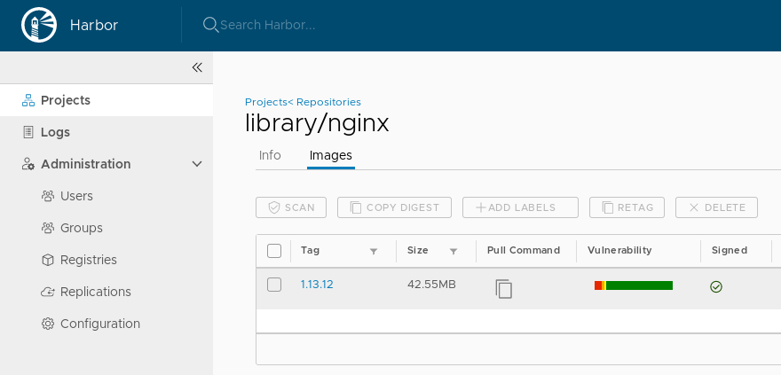

# Harbor and container images

Few more samples how you can work with container images in Harbor.

## Upload docker image

Create simple Docker image

```bash
echo admin | docker login --username aduser05 --password-stdin core2.${MY_DOMAIN}
```

Output:

```text
WARNING! Your password will be stored unencrypted in /home/pruzicka/.docker/config.json.
Configure a credential helper to remove this warning. See
https://docs.docker.com/engine/reference/commandline/login/#credentials-store

Login Succeeded
```

Download `kuard` docker image:

```bash
docker pull gcr.io/kuar-demo/kuard-amd64:blue
```

Output:

```text
blue: Pulling from kuar-demo/kuard-amd64
8e402f1a9c57: Pull complete
8df70f469ef0: Pull complete
Digest: sha256:1ecc9fb2c871302fdb57a25e0c076311b7b352b0a9246d442940ca8fb4efe229
Status: Downloaded newer image for gcr.io/kuar-demo/kuard-amd64:blue
```

Tag `kuard` with customized name to push to the private repository in Harbor:

```bash
docker tag gcr.io/kuar-demo/kuard-amd64:blue core2.${MY_DOMAIN}/my_project/kuard-amd64:blue
```

List all images:

```bash
docker images
```

Output:

```text
REPOSITORY                                TAG                 IMAGE ID            CREATED             SIZE
core2.mylabs.dev/my_project/kuard-amd64   blue                1db936caa6ac        2 months ago        23MB
gcr.io/kuar-demo/kuard-amd64              blue                1db936caa6ac        2 months ago        23MB
```

```bash
docker push core2.${MY_DOMAIN}/my_project/kuard-amd64:blue
```

Output:

```text
The push refers to repository [core2.mylabs.dev/my_project/kuard-amd64]
656e9c47289e: Pushed
bcf2f368fe23: Pushed
blue: digest: sha256:1ecc9fb2c871302fdb57a25e0c076311b7b352b0a9246d442940ca8fb4efe229 size: 739
```

It should be visible in the Harbor UI:


## Signed container image

YouTube video: [https://youtu.be/pPklSTJZY2E](https://youtu.be/pPklSTJZY2E)


Tag the `kuard` image to be pulled to Harbor `library` project:

```bash
docker tag gcr.io/kuar-demo/kuard-amd64:blue core2.${MY_DOMAIN}/library/kuard-amd64:blue
```

Push there the image:

```bash
export DOCKER_CONTENT_TRUST=1
export DOCKER_CONTENT_TRUST_SERVER=https://notary2.${MY_DOMAIN}
export DOCKER_CONTENT_TRUST_REPOSITORY_PASSPHRASE="mypassphrase123"
export DOCKER_CONTENT_TRUST_ROOT_PASSPHRASE="rootpassphrase123"
docker push core2.${MY_DOMAIN}/library/kuard-amd64:blue
```

Output:

```text
The push refers to repository [core2.mylabs.dev/library/kuard-amd64]
656e9c47289e: Mounted from my_project/kuard-amd64
bcf2f368fe23: Mounted from my_project/kuard-amd64
blue: digest: sha256:1ecc9fb2c871302fdb57a25e0c076311b7b352b0a9246d442940ca8fb4efe229 size: 739
Signing and pushing trust metadata
Finished initializing "core2.mylabs.dev/library/kuard-amd64"
Successfully signed core2.mylabs.dev/library/kuard-amd64:blue
```

You should be able to see the signed container image in the Harbor web
interface:



Install [Notary](https://github.com/theupdateframework/notary):

```bash
sudo curl -sL https://github.com/theupdateframework/notary/releases/download/v0.6.1/notary-Linux-amd64 -o /usr/local/bin/notary
sudo chmod a+x /usr/local/bin/notary
```

Access Notary using the standard client:

```bash
notary -s https://notary2.${MY_DOMAIN} list core2.${MY_DOMAIN}/library/kuard-amd64
```

Output:

```text
NAME    DIGEST                                                              SIZE (BYTES)    ROLE
----    ------                                                              ------------    ----
blue    1ecc9fb2c871302fdb57a25e0c076311b7b352b0a9246d442940ca8fb4efe229    739             targets
```

## Vulnerability scan

YouTube video: [https://youtu.be/K4tJ6B2cGR4](https://youtu.be/K4tJ6B2cGR4)


Wait for Clair to finish updating the "Vulnerability database" (it takes about
40 minutes):

```bash
COUNT=0; OUTPUT="{}"; while [ "${OUTPUT}" = "{}" ] && [ "${COUNT}" -lt 360 ]; do COUNT=$((COUNT+1)); OUTPUT=$(curl -s -u "admin:admin" "https://core2.${MY_DOMAIN}/api/systeminfo" | jq .clair_vulnerability_status); sleep 10; echo -n "${COUNT} ";  done
```

Check the logs form Clair pod to see when it was updated:

```bash
CLAIR_POD=$(kubectl get pods -l "app=harbor,component=clair" -n harbor2-system -o jsonpath="{.items[0].metadata.name}")
kubectl logs -n harbor2-system ${CLAIR_POD} | grep -E "(updating vulnerabilities|update finished)"
```

Output:

```text
{"Event":"updating vulnerabilities","Level":"info","Location":"updater.go:192","Time":"2019-06-05 11:58:06.285861"}
{"Event":"update finished","Level":"info","Location":"updater.go:223","Time":"2019-06-05 12:28:06.356515"}
```

See if "Vulnerability database" was successfully updated using API:

```bash
curl -s -u "admin:admin" "https://core2.${MY_DOMAIN}/api/systeminfo" | jq '.clair_vulnerability_status'
```

Output:

```json
{
  "overall_last_update": 1559737686,
  "details": [
    {
      "namespace": "oracle",
      "last_update": 1559737686
    },
    {
      "namespace": "centos",
      "last_update": 1559737686
    },
    {
      "namespace": "debian",
      "last_update": 1559737686
    },
    {
      "namespace": "alpine",
      "last_update": 1559737686
    },
    {
      "namespace": "ubuntu",
      "last_update": 1559737686
    }
  ]
}
```

Scan the image `kuard-amd64:blue` for vulnerabilities (using API):

```bash
curl -u "aduser05:admin" --header "Content-Type: application/json" -X POST "https://core2.${MY_DOMAIN}/api/repositories/my_project/kuard-amd64/tags/blue/scan"
```

Everything should be "green" - no vulnerability found:


Let's download popular web server [Nginx](https://nginx.com) based on Debian
Stretch from Docker Hub. The image is is one year old:
[https://hub.docker.com/_/nginx?tab=tags&page=5](https://hub.docker.com/_/nginx?tab=tags&page=5)

```bash
unset DOCKER_CONTENT_TRUST
docker pull nginx:1.13.12
```

Output:

```text
1.13.12: Pulling from library/nginx
f2aa67a397c4: Pull complete
3c091c23e29d: Pull complete
4a99993b8636: Pull complete
Digest: sha256:b1d09e9718890e6ebbbd2bc319ef1611559e30ce1b6f56b2e3b479d9da51dc35
Status: Downloaded newer image for nginx:1.13.12
```

Tag `nginx` to push to the private repository in Harbor:

```bash
docker tag nginx:1.13.12 core2.${MY_DOMAIN}/my_project/nginx:1.13.12
```

List all images:

```bash
docker images
```

Output:

```text
REPOSITORY                                TAG                 IMAGE ID            CREATED             SIZE
core2.mylabs.dev/library/kuard-amd64      blue                1db936caa6ac        2 months ago        23MB
core2.mylabs.dev/my_project/kuard-amd64   blue                1db936caa6ac        2 months ago        23MB
gcr.io/kuar-demo/kuard-amd64              blue                1db936caa6ac        2 months ago        23MB
core2.mylabs.dev/my_project/nginx         1.13.12             ae513a47849c        13 months ago       109MB
nginx                                     1.13.12             ae513a47849c        13 months ago       109MB
```

Push `nginx` docker image to Harbor:

```bash
docker push core2.${MY_DOMAIN}/my_project/nginx:1.13.12
```

Output:

```text
The push refers to repository [core2.mylabs.dev/my_project/nginx]
7ab428981537: Pushed
82b81d779f83: Pushed
d626a8ad97a1: Pushed
1.13.12: digest: sha256:e4f0474a75c510f40b37b6b7dc2516241ffa8bde5a442bde3d372c9519c84d90 size: 948
```

Scan the image for vulnerabilities:

```bash
curl -u "aduser06:admin" --header "Content-Type: application/json" -X POST "https://core2.${MY_DOMAIN}/api/repositories/my_project%2Fnginx/tags/1.13.12/scan"
```

You should see many vulnerabilities in the container image:


Vulnerability list for container image:


