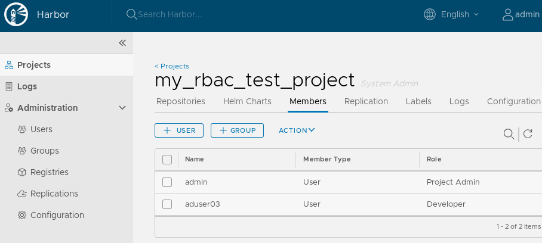

# Project settings

There are few project settings which are handy...

## Automatically scan images on push

Enable automated vulnerability scan after each "image push" to the project:
`library`:

```bash
PROJECT_ID=$(curl -s -u "aduser05:admin" -X GET "https://core.${MY_DOMAIN}/api/projects?name=library" | jq ".[].project_id")
curl -s -u "aduser05:admin" -X PUT "https://core.${MY_DOMAIN}/api/projects/${PROJECT_ID}" -H  "Content-Type: application/json" -d \
"{
  \"metadata\": {
    \"auto_scan\": \"true\"
  }
}"
```

You should see the following in the Web interface:


Tag the image:

```bash
docker tag nginx:1.13.12 core.${MY_DOMAIN}/library/nginx:1.13.12
```

Push the container image to Harbor project `library`:

```bash
docker push core.${MY_DOMAIN}/library/nginx:1.13.12
```

Output:

```text
The push refers to repository [core.mylabs.dev/library/nginx]
7ab428981537: Mounted from my_project/nginx
82b81d779f83: Mounted from my_project/nginx
d626a8ad97a1: Mounted from my_project/nginx
1.13.12: digest: sha256:e4f0474a75c510f40b37b6b7dc2516241ffa8bde5a442bde3d372c9519c84d90 size: 948
Signing and pushing trust metadata
Finished initializing "core.mylabs.dev/library/nginx"
Successfully signed core.mylabs.dev/library/nginx:1.13.12
```

All images in that repositories should be automatically checked for
vulnerabilities.

## Prevent vulnerable images from running

Now there are two container images in the `library` repository:

* `nginx:1.13.12` - which has many vulnerabilities
* `kuard:blue` - which has no vulnerabilities

Turn on the "Prevent vulnerable images from running" feature:

```bash
PROJECT_ID=$(curl -s -u "aduser05:admin" -X GET "https://core.${MY_DOMAIN}/api/projects?name=library" | jq ".[].project_id")
curl -s -u "aduser05:admin" -X PUT "https://core.${MY_DOMAIN}/api/projects/${PROJECT_ID}" -H  "Content-Type: application/json" -d \
"{
  \"metadata\": {
    \"prevent_vul\": \"true\",
    \"severity\": \"high\"
  }
}"
```


## Use image hosted by Harbor in k8s deployment

Create `kuard` deployment and expose it:

```bash
kubectl create namespace mytest
kubectl run kuard --image=core.${MY_DOMAIN}/library/kuard-amd64:blue --replicas=2 --port=8080 --expose=true --labels="app=kuard" -n mytest
```

Output:

```text
namespace/mytest created
kubectl run --generator=deployment/apps.v1 is DEPRECATED and will be removed in a future version. Use kubectl run --generator=run-pod/v1 or kubectl create instead.
service/kuard created
deployment.apps/kuard created
```

Create Ingress for kuard service:

```bash
envsubst < ../files/kuard_ingress.yaml | kubectl create -f -
```

Output:

```text
ingress.extensions/kuard created
```

You should be able to access kuard at [https://kuard.mylabs.dev](https://kuard.mylabs.dev)
and see this:


Try the same with `nginx:1.13.12` image:

```bash
kubectl run nginx --image=core.${MY_DOMAIN}/library/nginx:1.13.12 --image-pull-policy Always --replicas=2 --port=80 --expose=true --labels="app=nginx" -n mytest
```

Output:

```text
service/nginx created
deployment.apps/nginx created
```

If you check the pods you will see they are not running:

```bash
kubectl -n mytest get pods --selector=app=nginx
```

Output:

```text
NAME                     READY   STATUS             RESTARTS   AGE
nginx-77b487d974-vgsdb   0/1     ImagePullBackOff   0          8s
nginx-77b487d974-zjdmd   0/1     ImagePullBackOff   0          8s
```

The details of one of the pods looks like:

```bash
POD_NAME=$(kubectl -n mytest get pods --selector=app=nginx -o jsonpath='{.items[0].metadata.name}')
kubectl -n mytest describe pod $POD_NAME
```

Output:

```text
Name:               nginx-77b487d974-vgsdb
Namespace:          mytest
Priority:           0
PriorityClassName:  <none>
Node:               ip-192-168-55-129.eu-central-1.compute.internal/192.168.55.129
Start Time:         Mon, 27 May 2019 08:12:49 +0200
Labels:             app=nginx
                    pod-template-hash=77b487d974
Annotations:        <none>
Status:             Pending
IP:                 192.168.62.255
Controlled By:      ReplicaSet/nginx-77b487d974
Containers:
  nginx:
    Container ID:
    Image:          core.mylabs.dev/library/nginx:1.13.12
    Image ID:
    Port:           80/TCP
    Host Port:      0/TCP
    State:          Waiting
      Reason:       ImagePullBackOff
    Ready:          False
    Restart Count:  0
    Environment:    <none>
    Mounts:
      /var/run/secrets/kubernetes.io/serviceaccount from default-token-j55td (ro)
Conditions:
  Type              Status
  Initialized       True
  Ready             False
  ContainersReady   False
  PodScheduled      True
Volumes:
  default-token-j55td:
    Type:        Secret (a volume populated by a Secret)
    SecretName:  default-token-j55td
    Optional:    false
QoS Class:       BestEffort
Node-Selectors:  <none>
Tolerations:     node.kubernetes.io/not-ready:NoExecute for 300s
                 node.kubernetes.io/unreachable:NoExecute for 300s
Events:
  Type     Reason     Age                From                                                      Message
  ----     ------     ----               ----                                                      -------
  Normal   Scheduled  17s                default-scheduler                                         Successfully assigned mytest/nginx-77b487d974-vgsdb to ip-192-168-55-129.eu-central-1.compute.internal
  Normal   Pulling    17s                kubelet, ip-192-168-55-129.eu-central-1.compute.internal  pulling image "core.mylabs.dev/library/nginx:1.13.12"
  Warning  Failed     16s                kubelet, ip-192-168-55-129.eu-central-1.compute.internal  Failed to pull image "core.mylabs.dev/library/nginx:1.13.12": rpc error: code = Unknown desc = Error response from daemon: unknown: The severity of vulnerability of the image: "high" is equal or higher than the threshold in project setting: "high".
  Warning  Failed     16s                kubelet, ip-192-168-55-129.eu-central-1.compute.internal  Error: ErrImagePull
  Normal   BackOff    15s (x2 over 16s)  kubelet, ip-192-168-55-129.eu-central-1.compute.internal  Back-off pulling image "core.mylabs.dev/library/nginx:1.13.12"
  Warning  Failed     15s (x2 over 16s)  kubelet, ip-192-168-55-129.eu-central-1.compute.internal  Error: ImagePullBackOff
```

You are not able to run docker images with "High" security issues.

## Project RBAC settings

Create new project called `my_rbac_test_project`

```bash
curl -u "admin:admin" -X POST -H "Content-Type: application/json" "https://core.${MY_DOMAIN}/api/projects" -d \
"{
  \"project_name\": \"my_rbac_test_project\",
  \"public\": 0
}"
```

Try to push the kuard image as a "Guest" user:

```bash
echo admin | docker login --username aduser04 --password-stdin core.${MY_DOMAIN}
docker tag gcr.io/kuar-demo/kuard-amd64:blue core.${MY_DOMAIN}/my_rbac_test_project/kuard-amd64:blue
docker push core.${MY_DOMAIN}/my_rbac_test_project/kuard-amd64:blue
```

Output:

```text
WARNING! Your password will be stored unencrypted in /home/pruzicka/.docker/config.json.
Configure a credential helper to remove this warning. See
https://docs.docker.com/engine/reference/commandline/login/#credentials-store

Login Succeeded
The push refers to repository [core.mylabs.dev/my_rbac_test_project/kuard-amd64]
656e9c47289e: Preparing
bcf2f368fe23: Preparing
denied: requested access to the resource is denied
```

* Guests are not allow to push anything into the projects.

Add user `aduser04` on the project `my_rbac_test_project` as a Developer:

```bash
PROJECT_ID=$(curl -s -u "admin:admin" -X GET "https://core.${MY_DOMAIN}/api/projects?name=my_rbac_test_project" | jq ".[].project_id")
curl -u "admin:admin" -X POST "https://core.${MY_DOMAIN}/api/projects/${PROJECT_ID}/members" -H "Content-Type: application/json" -d \
"{
  \"role_id\": 2,
  \"member_user\": {
    \"username\": \"aduser04\"
  }
}"
```



Push the container image again:

```bash
docker push core.${MY_DOMAIN}/my_rbac_test_project/kuard-amd64:blue
```

Output:

```text
The push refers to repository [core.mylabs.dev/my_rbac_test_project/kuard-amd64]
656e9c47289e: Mounted from library/kuard-amd64
bcf2f368fe23: Mounted from library/kuard-amd64
blue: digest: sha256:1ecc9fb2c871302fdb57a25e0c076311b7b352b0a9246d442940ca8fb4efe229 size: 739
Signing and pushing trust metadata
Finished initializing "core.mylabs.dev/my_rbac_test_project/kuard-amd64"
Successfully signed core.mylabs.dev/my_rbac_test_project/kuard-amd64:blue
```

Now the image was successfully uploaded:


